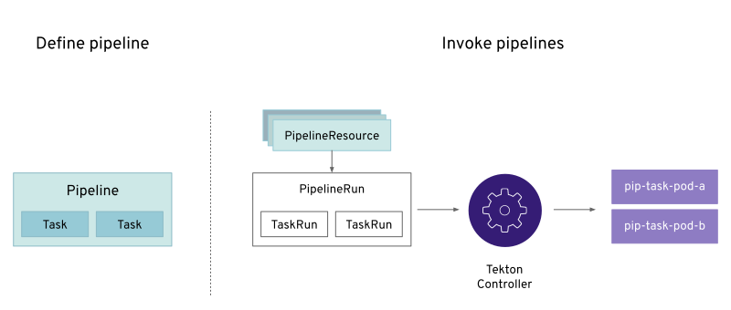

Tekton defines a number of link:https://kubernetes.io/docs/concepts/extend-kubernetes/api-extension/custom-resources/[Kubernetes custom resources] as building blocks in order to standardize pipeline concepts and provide a terminology that is consistent across CI/CD solutions. These custom resources are an extension of the Kubernetes API that let users create and interact with these objects using the OpenShift CLI (`oc`), `kubectl`, and other Kubernetes tools.

The custom resources needed to define a `pipeline` are listed below:

* `Task`: a reusable, loosely coupled number of steps that perform a specific task (e.g., building a container image)
* `Pipeline`: the definition of the `pipeline` and the `tasks` that it should perform
* `PipelineResource`: inputs (e.g., git repository) and outputs (e.g., image registry) to and out of a `pipeline` or `task`
* `TaskRun`: the instantiation and the result (i.e., success or failure) of running an instance of `task`
* `PipelineRun`: the instantiation and the result (i.e., success or failure) of running an instance of `pipeline`, which includes a number of `taskruns`

In short, in order to create a `pipeline`, one does the following:

* Create custom or install link:https://github.com/tektoncd/catalog[existing] reusable `tasks`
* Create a `pipeline` and `pipelneresources` to define your application's delivery `pipeline`
* Create a `pipelinerun` to instantiate and invoke the `pipeline`

For further details on pipeline concepts, refer to the link:https://github.com/tektoncd/pipeline/tree/master/docs#learn-more[Tekton documentation] that provides an excellent guide for understanding various parameters and attributes available for defining `pipelines`.

In the following sections, you will go through each of the above steps to define and invoke a `pipeline`.
