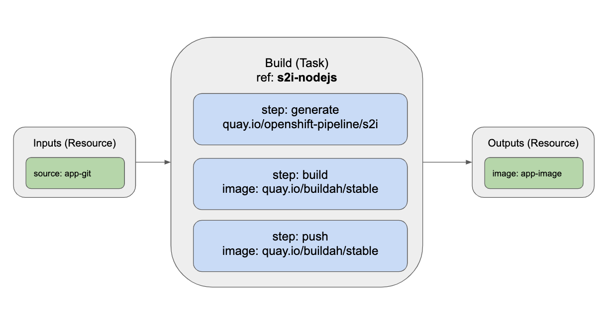
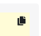
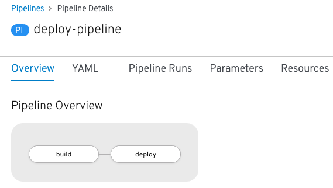

A pipeline defines a number of tasks that should be executed and how they interact
with each other via their inputs and outputs.

In this tutorial, you will create a pipeline that takes the source code of a Node.js
application from GitHub and then builds and deploys it on OpenShift using s2i and Buildah.

Below is a YAML file that represents the above pipeline:

[source,yaml,role=copy]
----
apiVersion: tekton.dev/v1alpha1
kind: Pipeline
metadata:
  name: deploy-pipeline
spec:
  resources:
  - name: app-git
    type: git
  - name: app-image
    type: image
  tasks:
  - name: build
    taskRef:
      name: s2i-nodejs
    params:
      - name: TLSVERIFY
        value: "false"
    resources:
      inputs:
      - name: source
        resource: app-git
      outputs:
      - name: image
        resource: app-image
  - name: deploy
    taskRef:
      name: openshift-client
    runAfter:
      - build
    params:
    - name: ARGS
      value: "rollout latest nodejs-ex"
----

This pipeline performs the following:

1. Clones the source code of the application from a git repository (i.e. `app-git` resource)
2. Builds the container image using the `s2i-nodejs` task that generates a Dockerfile for the application and uses Buildah to build the image
3. The application image is pushed to an image registry (i.e. `app-image` resource)
4. The new application image is deployed on OpenShift using the `openshift-client` task

The pipeline definition above shows how tasks can be added to a pipeline.
Each pipeline has a `tasks` property. Under this property, each `task` has a `name`.
For this pipeline, it has two tasks named `build` and `deploy`. The `taskRef` property under each
task `name` is where the tasks you just created can be specified as part of the pipeline.

A visual that shows how `s2i-nodejs` is part of the pipeline above can be seen below:

You might have noticed that there are no references to the `nodejs-ex` git repository
and the image registry url. That's because pipelines in Tekton are designed to
be generic and reusable across environments and stages through the application's lifecycle.

Pipelines abstract away the specifics of the git source repository and image registry to be
produced as pipeline resources. When triggering a pipeline, you can provide different
git repositories and image registries to be used during a pipeline execution. You
will do that in the next section.

For the `deploy` task of the pipeline, you can see under the `params` property that
a value is passed: `"rollout latest nodejs-ex"`. This argument is how `oc rollout latest nodejs-ex`
will be run for the `oc` step of the `openshift-client` `task`. This command deploys
an image called `nodejs-ex` that has the tag `latest` associated with it, meaning the
most recently pushed version of the image.

The execution order of tasks is determined based on the dependencies that are
defined between the tasks via `inputs` and `outputs` as well as explicit orders
that are defined via `runAfter`. You'll notice the `deploy` task above has a `runAfter`
property specifying to only execute after the `build` task is complete.

A visualization of the pipeline above is shown below to help illustrate what has been
described so far in this section:

image:../images/pipeline-visual.png[Pipeline Visualization]

Create the Pipeline
-------------------

To create the pipeline described above, you have the option of either using the OpenShift web
console or `oc` from the command line. Instructions are available for both options below. Only
go through the steps for one option, but feel free to read and learn both ways of creating a pipeline.

Web Console
-----------

To create a pipeline through the web console, start by copying the pipeline YAML
definition above. You can do this by clicking on the icon shown below in the screenshot
on the pipeline YAML definition above. Simply scroll back up to the pipeline definition
to proceed with copying the pipeline definition.

Next, head out to the OpenShift web console by clicking on the
**Console** tab at the center top of the workshop in your browser.

Once in the web console, you will notice the icons shown in the screenshot below
at the top of the web console.

Click the plus (**+**) symbol. Clicking this button will take you to the Import YAML
section of the web console where you can add the YAML definition of Kubernetes resources you
want to create. This page isn't just for creating a Tekton pipeline resource as you can
create any Kubernetes resource definition on this page, including other Tekton resources.

Using the paste shortcut on your laptop (e.g. `command + v for Macs`, `control + v for PCs`, etc.),
paste the YAML definition of the pipeline you copied earlier into the text editor on
the web console screen.

Now that your pipeline definition is in the text editor, click the **Create** button
underneath the text editor.

After clicking **Create**, you will be taken to the **Pipelines** tab of the web console
and should see an overview page with details about the pipeline you created similar
to what is shown in the screenshot below:

You will learn more about this page in a little bit in this section, but, for now, head over
to the main page of the **Pipelines** tab by clicking on the **Pipelines** tab on
the left side of the web console.

To continue with the workshop, head to the **Pipeline Web Console Features** portion
of this section, but also feel free to read about creating a pipeline through `oc`. Just
remember to not run the `oc create` command since you have already created your pipeline.

OpenShift CLI
-------------

The command below uses `oc` to take the pipeline definition from above from a
local directory and then creates it in your OpenShift project. Run the command below to
create the pipeline:

[source,bash,role=execute-1]
----
oc create -f exercise/deploy-pipeline.yaml
----

You can see the pipeline you have created using `tkn`:

[source,bash,role=execute-1]
----
tkn pipeline ls
----

You can view the pipeline through the OpenShift web console by clicking on the
**Console** tab at the center top of the workshop in your browser.

Next, click on the **Pipelines** tab on the left side of the web console.

Pipeline Web Console Features
-----------------------------

Now that you have created your pipeline, you can view it via the OpenShift web console.
Make sure you are on the **Pipelines** tab main page of the web console.

Once on this page, you should see the pipeline you just created (i.e. `deploy-pipeline`)
listed like in the image below:

image:../images/deploy-pipeline-console.png[deploy-pipeline Web Console]

The column **Last Run** will indicate the last pipeline run that has occurred for `deploy-pipeline`.
The **Last Run Status** will display whether a pipeline run succeeded or failed.
**Task Status** will show the status of each task that is running as part of `deploy-pipeline`.
Finally, **Last Run Time** will indicate how long ago the last pipeline run for `deploy-pipeline`
was.

By clicking on the three dots shown in the photo below to the right of the **Last Run Time**, you will see
how you can trigger a pipeline run from the web console using the **Start** or **Start Last Run** options
to start a pipeline run. The **Start Last Run** option is not available yet as `deploy-pipeline`
has never been executed yet. There is also a **Delete** option to remove pipelines from your
project namespace.

image:../images/web-console-options.png[Web Console Options]

Click on the name `deploy-pipeline` under the **Name** column. This will take you to
an overview page that shows more information about `deploy-pipeline`, including tasks
on the pipeline.

This page also features tabs that show the YAML definition of the
pipeline resource created, all pipeline runs for `deploy-pipeline`, and the ability to
define parameters as well as resources for `deploy-pipeline`.

If you click on the **Resources** tab, you will see that `deploy-pipeline` requires
two pipeline resources: `app-git` and `app-image` as shown below:

image:../images/pipeline-resources-console.png[Pipeline Resources Console]

You will need to create these resources so that `deploy-pipeline` has the proper git repo
input and knows where to push the resulting image for `nodejs-ex` to.

Before moving on to the next section, click the **Pipelines** tab on the left side
of the web console to return to the **Pipelines** tab main page.

In the next section, you will focus on creating the `app-git` and `app-image` pipeline
resources. Clear your terminal before continuing:

[source,bash,role=execute-1]
----
clear
----
