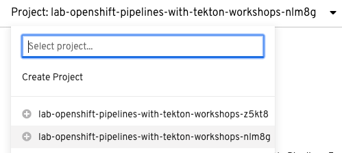
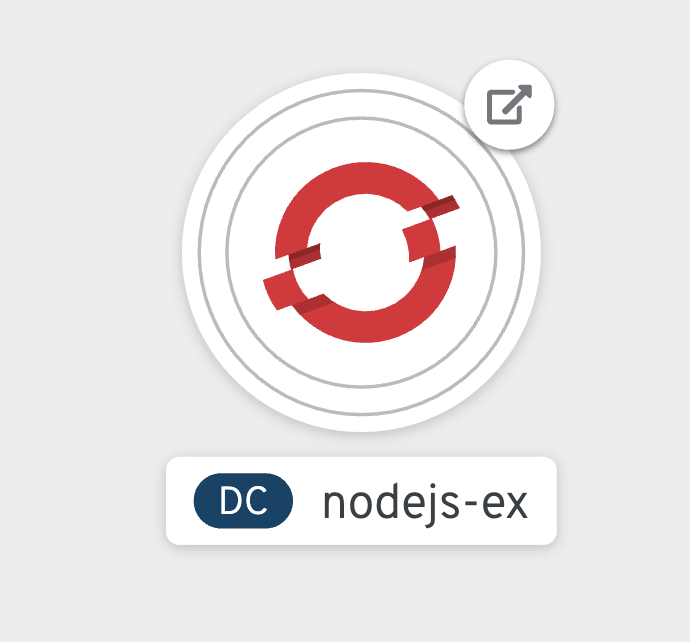

For this tutorial, you're going to use a simple Node.js application that interacts with a
MongoDB database. The workshop is configured to provide you a pre-created OpenShift project
(i.e., Kubernetes namespace) where you will set up supplementary resources for your
application for its eventual deployment.

We can verify the name of the project with:

[source,bash,role=execute-1]
----
oc project -q
----

You will use the link:https://github.com/sclorg/nodejs-ex[nodejs-ex] sample application
during this workshop (i.e. the Node.js application).

To prepare for `nodejs-ex's` eventual deployment, you will create Kubernetes objects that
are supplementary to the application, such as a route (i.e. url). The deployment will not
complete since there are no container images built for the `nodejs-ex` application yet.
That you will do in the following sections through a CI/CD pipeline.

Create the supplementary Kubernetes objects by running the command below:

[source,bash,role=execute-1]
----
oc create -f sampleapp/sampleapp.yaml
----

`nodejs-ex` also needs a MongoDB database. You can deploy a container with MongoDB
to your OpenShift project by running the following command:

[source,bash,role=execute-1]
----
oc new-app centos/mongodb-36-centos7 -e MONGODB_USER=admin MONGODB_DATABASE=mongo_db MONGODB_PASSWORD=secret MONGODB_ADMIN_PASSWORD=super-secret
----

You should see `-> Success` in the output of the command, which verifies the successful
deployment of the container image.

The command above uses a container image with a CentOS 7 operating system and MongoDB 3.6
installed. It also sets environment variables using the `-e` option. These environment
variables are needed by MongoDB for its deployment, such as the username, database name,
password, and the admin password.

Next, let's grab the IP address of the database container. This will be used to connect
the `nodejs-ex` application to the MongoDB. Run the command below:

[source,bash,role=execute-1]
----
export CIP=$(oc get svc -o jsonpath={.items[0].spec.clusterIP})
----

The above command returns the services running in your OpenShift project and grabs
the `clusterIP` from the first element returned, which will correspond to the MongoDB
database you just deployed.

The last step is to set an environment variable for `nodejs-ex` that will provide the
application the URL to connect to the MongoDB. This will use the IP address stored
as the environment variable `CIP` above. To do this, run the following command:

[source,bash,role=execute-1]
----
oc set env dc/nodejs-ex MONGO_URL="mongodb://admin:secret@$CIP:27017/mongo_db"
----

To verify the resources needed to support `nodejs-ex` and the MongoDB have been created,
you can head out to the OpenShift web console.

**NOTE:** An error message may appear when you first visit the console due to the fact that your
user for this workshop does not have permissions to view projects other than your own. The web console
may start on a different project other than the one you are using for this workshop, but all you will need
to do is follow the instructions below to navigate to your project.

You can make your way to the web console by clicking on the **Console** tab next to the
**Terminal** tab at the center top of the workshop in your browser.

Make sure the **Developer** option from the dropdown in the top left corner of the web console
is selected as shown below:

image:../images/developer-view.png[Developer View]

Next, select the Project dropdown menu shown below and choose the project namespace you have
been working with. As a reminder, the project you are using is **%project_namespace%** and this
will differ from what is shown in the photo below:

Next, click on the **Topology** tab on the left side of the web console if you don't
see the what's in the image below. Once in the **Topology** view, you can see the deployment
config for the `nodejs-ex` application and the MongoDB, which will look similar to what
is shown in the image below:

You'll notice the white circle around the `nodejs-ex` deployment config. This means
that `nodejs-ex` isn't running yet.

The mongodb-36-centos7 deployment config has a dark blue circle around it, meaning that
a pod is running with the MongoDB container on it. The MongoDB should be all set
to support the `nodejs-ex` application at this point.

In the next section, you'll learn how to use Tekton tasks. Clear your terminal before continuing.
Running the command below will also return you to the terminal:

[source,bash,role=execute-1]
----
clear
----
