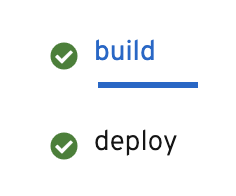

Now that `deploy-pipeline` has finished successfully, take a further look into the
logs available through the web console. You should be able to access the logs under the
**Pipelines** tab the same way we did earlier if you are not still on the logs page of
the web console from before.

Once on the logs page, you will notice the pipeline run name at the top of the logs.
OpenShift will save all the logs for a particular pipeline run in case you wish to
go back and review the logs.

As mentioned previously, the tasks of `deploy-pipeline` are listed on the left side
of the logs. You should see the `build` and `deploy` tasks as is shown in the screenshot
below:

The green circle with a check icon mean the tasks ran successfully. Click on
the `build` task to dig into what the `build` task executed.

You should notice the first step that executed as part of the `build` task: `STEP-GENERATE`.
The result of this step should be as follows:

[source,bash]
----
Application dockerfile generated in /gen-source/Dockerfile.gen
----

This indicates that the command ran for this step (i.e. `s2i build`) created a Dockerfile
based on the source code provided (i.e. a Node.js application). This Dockerfile contains
the container image definition needed for the next important step of the `build` task:
`STEP-BUILD`.

`STEP-BUILD` uses a Buildah command to build the Dockerfile created by s2i. You should
see in the logs under `STEP-BUILD` instructions defined in the Dockerfile for building
the container needed to host Node.js source code as well as starting up that source code
once the container is deployed.

If you scroll down the logs of `STEP-BUILD`, the instructions for building the container
include steps to make sure the container does not run as a root user (`STEP 3` and `STEP 6`).
It also uses `npm` to install dependencies for `nodejs-ex` (`STEP 7`). Finally, you
should see a commit to the OpenShift image registry (`STEP 9`).

The last step of note is `STEP-PUSH` that shows details of pushing the commit from
`STEP-BUILD` to the OpenShift image registry. You can scroll down to the end of the logs
to see the output of this step.

You can also view more information about the pipeline run via `tkn` by running the
command below:

[source,bash,role=execute-1]
----
tkn pr describe $RUN
----

The command above provides you with all the details of the pipeline run that just
executed. Of note, you can see the `DURATION` of each task run as part of your pipeline
run to better understand bottle necks that may be causing pipelines to take longer.

Now that you have seen details of how your pipeline run executed and have seen how
to interpret CI/CD logs, it's time to check out the deployed application on OpenShift.

Click Continue to verify the deployment of `nodejs-ex`.
