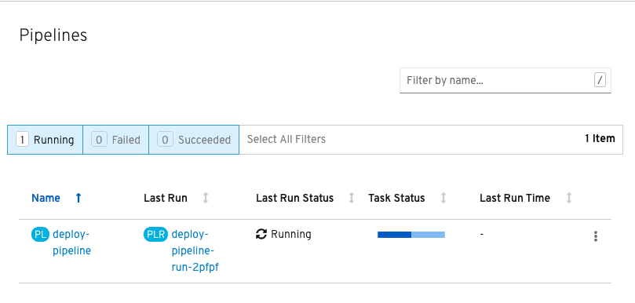

Now that the `pipeline` is created, you can trigger it to execute the `tasks` specified on the `pipeline`. As mentioned earlier, a `pipelinerun` is the custom resource used to trigger a `pipeline`. In this exercise, you will create a `pipelinerun` via `tkn` to deploy the Spring PetClinic application out to OpenShift.

First, you should create `pipelineresources` that contain the specifics of the Git repository and image registry to be used in the `pipeline` during execution. These are also reusable across multiple pipelines.

The following `pipelineresource` defines the Git repository and reference for the PetClinic application:

[source,yaml]
----
apiVersion: tekton.dev/v1alpha1
kind: PipelineResource
metadata:
  name: petclinic-git
spec:
  type: git
  params:
  - name: url
    value: https://github.com/spring-projects/spring-petclinic
----

And the following defines the OpenShift internal registry for the PetClinic image to be pushed to:

[source,yaml]
----
apiVersion: tekton.dev/v1alpha1
kind: PipelineResource
metadata:
  name: petclinic-image
spec:
  type: image
  params:
  - name: url
    value: image-registry.openshift-image-registry.svc:5000/pipelines-tutorial/spring-petclinic
----

Create the above `pipelineresources` via the OpenShift web console using the same steps used earlier for creating the `pipeline` or execute the `oc` commands below.

Add the Git repository input for the `pipeline`:

[source,bash,role=execute-1]
----
oc create -f exercise/petclinic-git-pipeline-resource.yaml
----

Add the registry for the Spring PetClinic image to be pushed to as an output for the `pipeline`:

[source,bash,role=execute-1]
----
oc create -f exercise/petclinic-image-pipeline-resource.yaml
----

You can see the `pipelineresources` created using `tkn`:

[source,bash,role=execute-1]
----
tkn resource ls
----

The `pipelinerun` definition below is how you can trigger the `pipeline` and tie it to the git and image resources that are used for this specific invocation:

[source,yaml]
----
apiVersion: tekton.dev/v1alpha1
kind: PipelineRun
metadata:
  generateName: petclinic-deploy-pipelinerun-
spec:
  pipelineRef:
    name: deploy-pipeline
  trigger:
    type: manual
  serviceAccount: 'pipeline'
  resources:
  - name: app-git
    resourceRef:
      name: petclinic-git
  - name: app-image
    resourceRef:
      name: petclinic-image
----

Under the `spec` property, you'll see the `pipelineRef` property where the `pipeline` to be used is specified.

Since this `pipelinerun` will be triggered manually by you using `tkn`, the `trigger` property is used to specify when the `pipeline` should execute. This property is how a webhook can be used to trigger a `pipelinerun` via a code commit to a git repository.

The last property of the `pipelinerun` of note is `resources`. This is how specific git repository and image registry urls can be entered for the `pipelinerun`. You'll see the `pipelineresource` references we just created in the `pipelinerun` definition.

While learning about the resource definition behind a `pipelinerun` is important, you do not have to define this resource yourself to trigger a `pipelinerun`. You can create the above `pipelinerun` to deploy the sample application out to OpenShift via `tkn`:

[source,bash,role=execute-1]
----
tkn pipeline start deploy-pipeline \
        -r app-git=petclinic-git \
        -r app-image=petclinic-image \
        -s pipeline
----

The `pipeline` you created earlier is now instantiated and creating a number of pods to execute the `tasks` that are defined as part of the `pipeline`. After a few minutes, the `pipelinerun` should finish successfully.

To view the `pipelinerun` created, run the following `tkn` command:

[source,bash,role=execute-1]
----
tkn pr ls
----

You can view the logs of `pipelinerun` as it executes using the Tekton CLI and also visualize the `pipelinerun` through the OpenShift web console.

Tekton CLI Logs
---------------

You'll need to take the name of the `pipelinerun` from the output of `tkn pr ls` and add it to the command below. Next, copy and paste the command below into the lower terminal and run it with your `pipelinerun` name to see the logs:

[source,bash]
----
tkn pr logs REPLACE_WITH_PIPELINERUN_NAME -f
----

The log output tells you what `tasks` are running as well as what steps is running. You'll see the output structured as `[task_name : task_name-step-step_name]`. An example from this `pipelinerun` is below for the generate step of the build `task`:

[source,bash]
----
[build : build-step-generate]
----

Upon the successful completion of the `pipelinerun`, you will see the following output from the logs:

[source,bash]
----
[s2i-java-8 : nop] Build successful

[openshift-client : oc] deploymentconfig.apps.openshift.io/spring-petclinic rolled out

[openshift-client : nop] Build successful
----

Web Console Visualization
-------------------------

You can watch the execution of a `pipelinerun` through the OpenShift web console by clicking on the **Console** tab next to the **Terminal** tab at the center top of the workshop in your browser.

Click on where it says **Administrator** and select the **Developer** option from the dropdown. Next, select the Project dropdown menu and choose to the project namespace you have been working with:

You can run the command below if you don't remember your project:

[source,bash,role=execute-1]
----
oc project -q
----

Once you have selected your project, click on the **Pipelines** tab on the left hand side of the web console. You will see the name of the `pipeline` and, under the **Last Run** column, the name of the current `pipelinerun`. Click on the `pipelinerun` name:

After clicking on the `pipelinerun` name, you should see the `tasks` as part of your `pipeline` executing similar to the output below:

image:../images/web-console-tasks.png[Web Console Tasks]

Since this is not the official OpenShift 4.2 web console, you will not be able to view the logs through the web console, but this will be available in the official OpenShift 4.2 web console release.

Verify Deployment
-----------------

Looking back at the project, you should see that the PetClinic image is successfully built and deployed.

image:../images/petclinic-deployed-2.png[PetClinic Deployed]

= TODO: Add how to view successfully deployed application via its route
