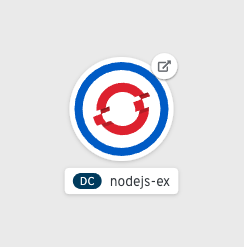

To verify `nodejs-ex's` successful deployment, head back out to the web console by
clicking on the **Console** at the center top of the workshop in your browser.

Click on the **Topology** tab on the left side of the web console. You should
see something similar to what is shown in the screenshot below:

The **Topology** view of the OpenShift web console helps to visually show what is
deployed out to your OpenShift project. As mentioned earlier, the dark blue lining around
the `nodejs-ex` circle means that a container is started up and running the `nodejs-ex` application.
By clicking on the arrow icon as shown below, you can open the `nodejs-ex`'s url in a new tab
and see the application running.

image:../images/url-icon.png[URL Icon]

After clicking on the icon, you should see the `nodejs-ex` running in a new tab.

One of the things you will notice about the application is the **Request information**
section in the bottom right corner of your browser. This shows how the MongoDB is
connected to `nodejs-ex`.

image:../images/request-information.png[Request information]

The MongoDB is used to store the amount of times the page is viewed. If you refresh
the page, the page view count will increment to show the page was loaded again.

If you were to redeploy `nodejs-ex` with another pipeline run, the data in the MongoDB
would persist. This would allow you to make updates to the application while preserving
the data that it uses.

Congratulations! You have successfully deployed your first application using OpenShift Pipelines.

Click Continue for additional resources on OpenShift Pipelines and Tekton.
