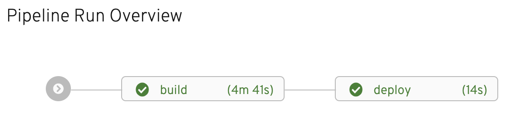

To verify nodejs-ex's successful deployment, head back out to the web console by
clicking on the **Console** at the center top of the workshop in your browser.

The first thing you should notice is the successful `task` completions under the
**Pipelines** tab, which should look similar to what's shown below:

Next, click on the **Topology** tab on the left side of the web console.

image:../images/topology-view-deployed.png[Topology View Deployed]

The **Topology** view of the OpenShift web console helps to visually show what is
deployed out to your OpenShift project. The circle with the OpenShift logo at
the center is meant to represent the nodejs-ex application you deployed via the `pipelinerun`.

The dark blue lining around the circle means that a container is started up and
running the nodejs-ex application. By clicking on the arrow icon as shown below,
you can open the application's url in a new tab and see the application running.

image:../images/url-icon.png[URL Icon]

After clicking on the icon, you should see the nodejs-ex running in a new tab.

Congratulations! You have successfully deployed your first application using OpenShift Pipelines.

Click Continue for additional resources on OpenShift Pipelines and Tekton.
