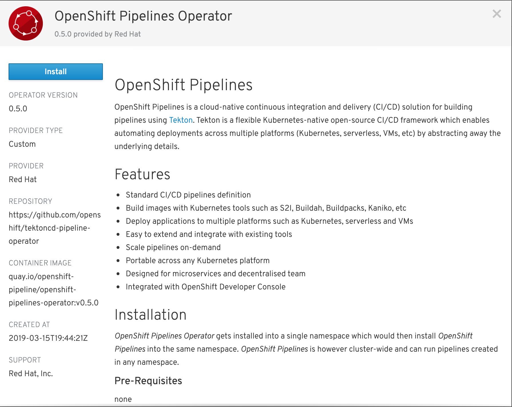
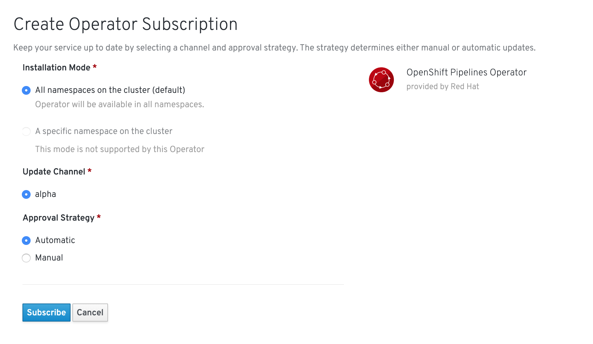
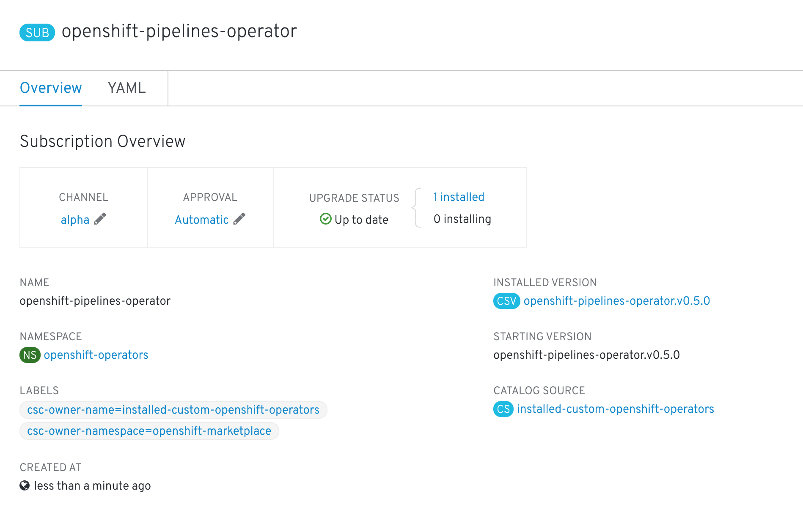

OpenShift Pipelines is provided as an add-on on top of OpenShift that can be installed via an operator that is available in the OpenShift OperatorHub.

The OpenShift Pipelines operator installs globally on the cluster and will then monitor and manage `pipelines` for every single user in the cluster.

To install the operator, you need to be a cluster administrator user. In this workshop environment, the operator has already been installed for you. Nevertheless, this is the process we followed in order to install the operator. These instructions are for reference, as you will not be able to see these screens in the embedded console in the workshop due to your user's lack of the required privileges.

== Install process

Go to **Catalog > OperatorHub** in the web console. You can see the list of available operators for OpenShift provided by Red Hat as well as a community of partners and open-source projects.

Click on the **Integration & Delivery** category to find the **OpenShift Pipeline Operator**.

image:images/operatorhub.png[OpenShift OperatorHub]

Click on **OpenShift Pipelines Operator**, **Continue**, and then **Install**.

TODO: Update image

Leave the default values. The operator will install globally and it will run in the `openshift-operators` project, as this is the pre-configured project for all **Global operators**. Click on **Subscribe** in order to subscribe to the installation and update channels.

TODO: Update image

The operator is installed when you see the status updated from `1 installing` to `1 installed`. This operator automates installation and updates of OpenShift Pipelines on the cluster as well as applying all configurations needed.

TODO: Update image

That's all. The operator now installs and manages OpenShift Pipelines on the cluster.
